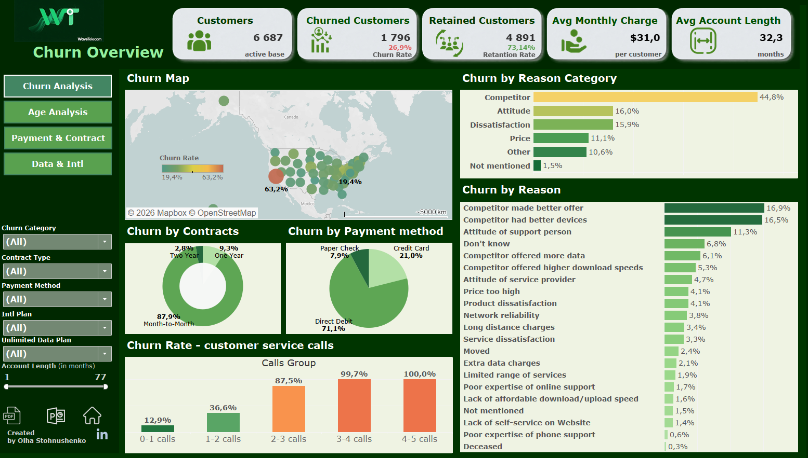

# wavetelecom-churn-dashboard
Telecom customer churn analysis dashboard built with Tableau
# 📊 WaveTelecom — Churn Analysis Dashboard

> An interactive multi-page Tableau dashboard with a full analytical report analyzing customer churn behavior across geography, demographics, contracts, payment methods, and service usage patterns.

🔗 **[View Live Dashboard on Tableau Public](https://public.tableau.com/app/profile/olha.stohnushenko/viz/Telecom_Churn_Analysis_OS/General)**

## 📌 Project Overview

WaveTelecom is a fictional telecom company used as a case study for churn analytics. This project identifies **who churns, why they churn, and what behavioral signals predict churn** — across 4 interactive dashboard pages built in Tableau Public, supported by a full analytical report with data-verified findings and 8 strategic recommendations.

The overall churn rate of **26.9% significantly exceeds the telecom industry benchmark of ~20%**, indicating a systemic retention problem. Notably, churned customers pay an average of **$36.8/month — 18.7% more** than the overall base, meaning the company is losing its highest-value segment disproportionately.

---

## 📈 Key Metrics at a Glance

| Metric | Value | Note |
|---|---|---|
| Total Active Customers | **6,687** | Active base |
| Churned Customers | **1,796** | Lost customers |
| **Churn Rate** | **26.9%** | Industry avg ~20% |
| Retention Rate | **73.14%** | Active base |
| Avg Monthly Charge | **$31.0** | All customers |
| Avg Monthly Charge (Churned) | **$36.8** | +18.7% vs retained |
| Avg Account Length | **32.3 months** | All customers |
| Avg Age at Churn | **50.5 years** | Mean churner age |

---

## 🗂️ Dashboard Pages & Key Findings

### 1. 🌍 Churn Overview & Geographic Analysis

**Churn Map** reveals significant regional variation across US states:

| State | Churn Rate | Assessment |
|---|---|---|
| CA (California) | **63.2%** | 🔴 Critical — highest in the country |
| OH (Ohio) | 34.8% | 🟠 High |
| PA (Pennsylvania) | 33.3% | 🟠 High |
| DC (Washington D.C.) | 19.4% | ✅ Best performer |
| OK (Oklahoma) | 19.5% | ✅ Low — strong retention |

> **California churn at 63.2% is more than 3× higher than DC (19.4%)** — suggesting localized competitive pressure or service quality issues requiring a dedicated state-level retention campaign.

**Churn by Reason Category:**

| Category | Share | Implication |
|---|---|---|
| Competitor | **44.8%** | Better offers or devices from rivals |
| Attitude | 16.0% | Negative service interactions |
| Dissatisfaction | 15.9% | Product or network unhappiness |
| Price | 11.1% | Perceived value gap |
| Other | 10.6% | Diverse minor factors |

Top specific reasons: Competitor made better offer (16.9%) · Competitor had better devices (16.5%) · Attitude of support person (11.3%)

**Churn Rate by Customer Service Calls — the strongest single predictor:**

| Calls Group | Churn Rate | Risk Level |
|---|---|---|
| 0–1 calls | 8.9% / 31.3% | Low / Moderate |
| 2–3 calls | 36.6% / **87.5%** | High / Critical |
| 4–5 calls | 99.7% / **100.0%** | Certain churn |

> Churn jumps 51 percentage points from 2 to 3 calls — this inflection point is the **3-Call Retention Trigger**.

---

### 2. 👥 Age Analysis

Churn risk increases consistently with age, with a sharp non-linear jump at 65+:

| Age Group | Churn Rate | vs. Overall | Avg Service Calls |
|---|---|---|---|
| Under 30 | 23.0% | -3.9 pp | 0.84 avg |
| 30–40 | 23.3% | -3.6 pp | — |
| 40–50 | 25.1% | -1.8 pp | — |
| 50–65 | 25.0% | -1.9 pp | 0.86 avg |
| **Senior 65+** | **38.5%** | **+11.6 pp** | **1.20 avg** |

**Senior vs. Non-Senior:**

| Segment | Customers | Churn Rate | Churn Count |
|---|---|---|---|
| Non-Senior | 5,460 | 24.3% | ~1,327 |
| Senior (65+) | 1,227 | **38.2%** | ~469 |

> Seniors are 18.4% of the base but 26.1% of churners — a **"high-pay, high-churn" paradox**. Retaining 20% of senior churners would save ~94 accounts/year.

**Group Contract Impact:**

| Status | Customers | Churn Rate |
|---|---|---|
| In Group | 1,521 | **6.5%** |
| Not in Group | 5,166 | **32.8%** |

> Group members churn at **5× lower rate** than individual customers — a structural loyalty effect, not a price discount effect (group avg charge: $22.5–23.1 vs $33.5 solo).

---

### 3. 💳 Payment & Contract Analysis

**Contract type is the dominant churn variable:**

| Contract Type | Churned | Churn Rate | Avg Monthly Charge |
|---|---|---|---|
| Month-to-Month | 1,579 | **46.3%** | $31.8 |
| One Year | 167 | 11.3% | $30.8 |
| Two Year | 50 | **2.8%** | $29.7 |

> 87.9% of all churned customers were on MTM contracts. Two-year holders churn at **~16× lower rate**.

**Payment method churn:**

| Payment Method | Churn Rate |
|---|---|
| Credit Card | **14.5%** — lowest |
| Direct Debit | 34.5% |
| Paper Check | **38.0%** — highest |

**Extra charges — billing surprise effect:**

| Extra Charge Tier | Churn Rate |
|---|---|
| $0 | 18.0% |
| **$1–$15** | **63.2%** — highest of all tiers |
| $15–$30 | 50.7% |
| $30+ | 30.1% |

> The unexpectedness of a charge matters more than its size — small surprise charges ($1–15) drive more churn than large ones.

---

### 4. 📡 Data & International Plan Analysis

**International Plan × Activity Matrix — most dramatic churn contrast in the dataset:**

| Intl Plan | Intl Active | Customers | Churn Rate |
|---|---|---|---|
| No | No | 3,939 | 20.0% — baseline |
| No | Yes | 2,097 | 40.3% — overbilled without plan |
| Yes | Yes | 474 | **7.6%** — best retention |
| Yes | No | 177 | **71.2%** — paying for unused plan |

**Unlimited Data Plan vs. Churn:**

| Plan | Customers | Churn Rate |
|---|---|---|
| No (standard) | 2,193 | **16.1%** |
| Yes (unlimited) | 4,494 | 32.1% |

**Data usage × plan interaction:**

| Monthly GB | No Unlimited | With Unlimited |
|---|---|---|
| 0–5 GB | 12.3% | **34.7%** — overpaying |
| 5–10 GB | 31.8% | 33.6% — minimal impact |
| 10+ GB | 27.6% | 27.7% — plan justified |

> Extra international charges avg **$33.6/mo** vs $3.4 for data — international plan misalignment is the **highest-value billing fix** in the dataset.

---

## 🔍 Top 8 Insights

| # | Insight | Impact |
|---|---|---|
| 1 | CA churn at 63.2% — 3× national low | Critical geographic risk |
| 2 | 44.8% of churn is competitor-driven | Product competitiveness gap |
| 3 | 3+ service calls = 87–100% churn | Strongest single predictor |
| 4 | MTM: 46.3% churn vs 2.8% two-year | 16× differential |
| 5 | Non-group customers churn 5× more | Loyalty structure gap |
| 6 | Seniors: 38.2% churn, highest charges | High-value at-risk segment |
| 7 | Intl plan without usage: 71.2% churn | Plan misalignment critical |
| 8 | Low-GB users on unlimited: 34.7% churn | Data plan right-sizing need |

---

## 💡 Strategic Recommendations

| # | Recommendation | Effort | Impact | Priority |
|---|---|---|---|---|
| R1 | **3-Call Retention Trigger** — CRM auto-flag at 3rd call → senior agent within 24h | Low | High | 🔴 Immediate |
| R2 | **California Emergency Campaign** — exit surveys, pricing audit, proactive outreach | Medium | High | 🔴 Immediate |
| R3 | **Intl Plan Auto-Recommendation Engine** — match plan to actual usage automatically | Medium | Very High | 🔴 Immediate |
| R4 | **MTM Contract Migration** — 10–15% discount for upgrading to annual/biannual | Medium | High | 🟠 High |
| R5 | **Senior Retention Program** — simplified billing, priority support, quarterly check-ins | Medium | Medium | 🟠 High |
| R6 | **Group Plan Growth Initiative** — referral/family bundle with $3–5/mo per member | Low | Medium-High | 🟡 Medium |
| R7 | **Billing Transparency Initiative** — real-time usage alerts, pre-charge notifications | Low | Medium | 🟡 Medium |
| R8 | **Competitive Intelligence & Product Roadmap** — quarterly benchmarking, device programs | High | Very High | 🔵 Strategic |

---

## 🛠️ Tools & Technologies

| Tool | Purpose |
|---|---|
| **Tableau Public** | Dashboard design & interactivity |
| **Excel / CSV** | Source data (6,687 records — Databel dataset) |

---

## 🚀 How to Use

Open the [Tableau Public dashboard](https://public.tableau.com/app/profile/olha.stohnushenko/viz/Telecom_Churn_Analysis_OS/General) in your browser — no install required.

